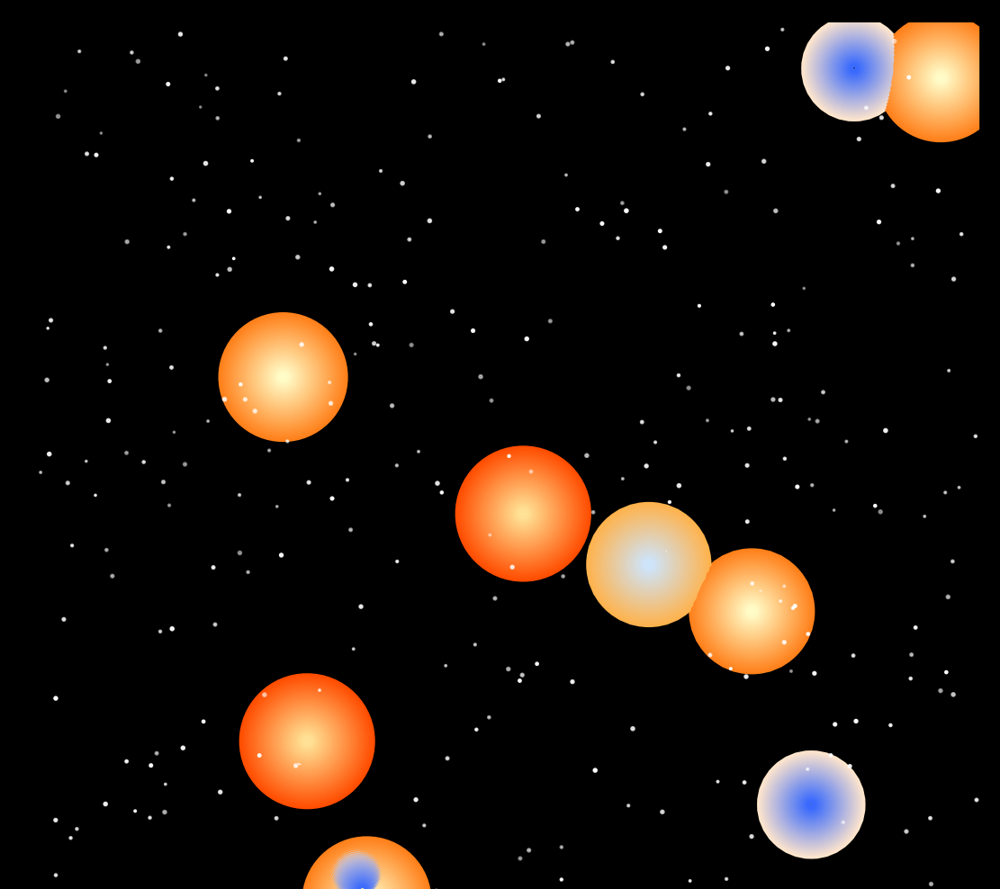

# 天体模拟器
这是一个基于 Python 和 Matplotlib 构建的恒星系统模拟器，模拟了多个天体在引力作用下的运动、碰撞和融合过程。

**主要特性**
* **特性一**：通过多层圆环绘制渐变色，视觉效果丰富（但也会因此占用更多性能）
* **特性二**：动画丝滑，天体融合有生长和消失动画，符合真实物理
* **特性三**:项目结构分明，保持单向数据流，各功能解耦清晰，易于扩展
## 目录
- [预览](#-预览)
- [快速开始](#-快速开始)
  - [前提条件](#前提条件)
  - [安装](#安装)
- [项目结构](#-项目结构)
- [配置](#-配置)

## 预览

## 快速开始
### 前提条件
* Python 3.8+
### 安装

**克隆仓库**
## 项目结构
```Python
star_simulation_matplotlib_version/
├── src/
│   ├── main_controller.py    # 主控制器 - 协调各模块运行
│   ├── physics_engine.py     # 物理引擎 - 计算运动和碰撞
│   ├── state.py              # 状态管理 - 维护模拟状态
│   ├── renderer.py           # 渲染器 - 处理图形绘制
│   ├── special_effect.py     # 特效系统 - 管理动画效果
│   └── config.py             # 配置参数 - 模拟和渲染参数
├── README.md
└── requirements.txt
```
